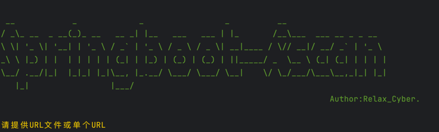
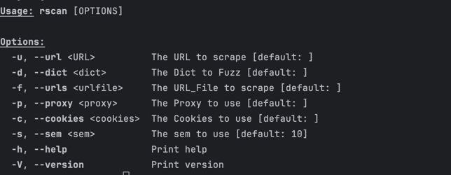

本工具采用Rust语言编写，支持Windows、Linux、MacOS等操作系统。

## 安装
1.配置rust环境：
```shell
curl --proto '=https' --tlsv1.2 -sSf https://sh.rustup.rs | sh
```
2. 运行：
```shell
cargo run --release -- 加上你需要的参数
```
## 使用
1. 代理扫描
```shell
cargo run --release -- -d 字典路径 -p 协议://IP:端口 -u 需要扫描的URL -s 需要的并发
```

2. 非代理扫描
```shell
cargo run --release -- -d 字典路径 -u 需要扫描的URL -s 需要的并发
```
2. 批量url扫描
```shell
cargo run --release -- -d 字典路径 -f 需要扫描的URL文件路径 -s 需要的并发
```
## 参数说明

-h 帮助：查看帮助信息。
-d 字典路径：字典路径，仅支持txt格式，默认为当前目录下的dict.txt。
-p 协议://IP:端口：代理访问，默认为无代理。
-u 需要扫描的URL：需要扫描的URL，支持多个URL，多个URL用英文逗号分隔。
-s 需要的并发：需要使用的并发数，默认为10。
-f 需要扫描的URL文件路径：需要扫描的URL文件路径，仅支持txt格式。

## 注意


本工具禁止用于商业及违法犯罪用途，仅供学习交流使用。